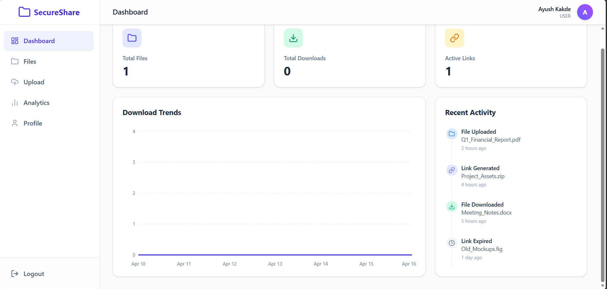
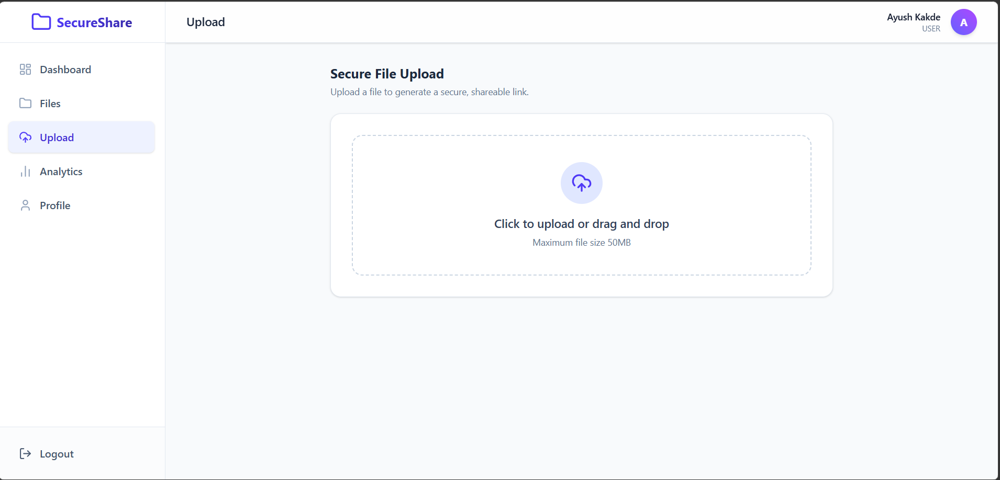
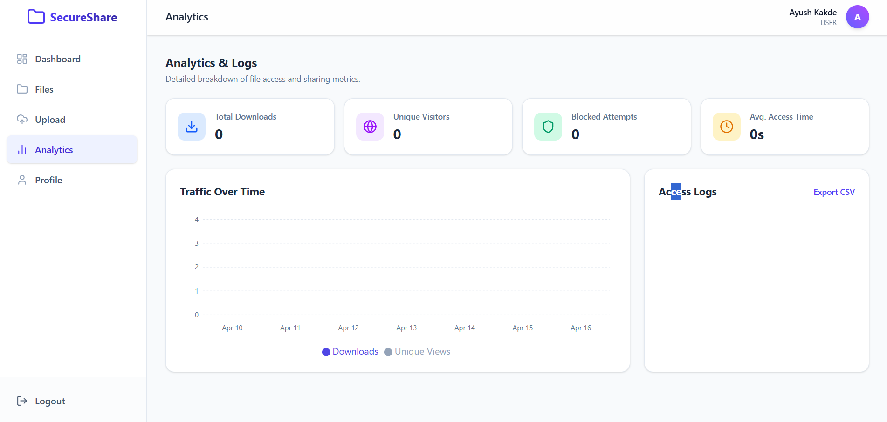

# 🔐 Secure File Sharing System

> A modern and secure platform to upload, share, and manage files with enhanced security features.

---

## 🚀 Features

✨ User Authentication (Login / Register)  
🔒 Secure File Upload & Download  
📁 File Management System  
🔗 Share Files via Links  
🛡️ Data Protection & Security  
⚡ Fast and Responsive UI  

---

## 🖼️ Project Preview

> Add your project screenshots below 👇

### 📸 Dashboard


### 📸 Upload Page


### 📸 Analytics Page


---

## 🛠️ Tech Stack

### Frontend
- React.js
- Vite
- Tailwind CSS

### Backend
- Spring Boot
- Java
- REST APIs

### Database
- MySQL / PostgreSQL

---

## 📂 Project Structure


Secure File Sharing System/
│
├── frontend/ # React Frontend
├── backend/ # Spring Boot Backend
├── screenshots/ # Project Images
└── README.md


---

## ⚙️ Installation & Setup

### 1️⃣ Clone Repository
```bash
git clone https://github.com/Kakdeayush/SECURE-FILE-SHARING-SYSTEM.git
2️⃣ Frontend Setup
cd frontend
npm install
npm run dev
3️⃣ Backend Setup
cd backend
mvn spring-boot:run
🔐 Security Features
Encrypted File Storage
Secure Authentication (JWT / Session)
Access Control
Protected APIs
📌 Future Enhancements
📦 Cloud Storage Integration
📧 Email Sharing System
🔑 End-to-End Encryption
📊 Admin Dashboard
👨‍💻 Author

Ayush Kakde

GitHub: https://github.com/Kakdeayush
⭐ Support

If you like this project:

👉 Give it a ⭐ on GitHub
👉 Share with others
